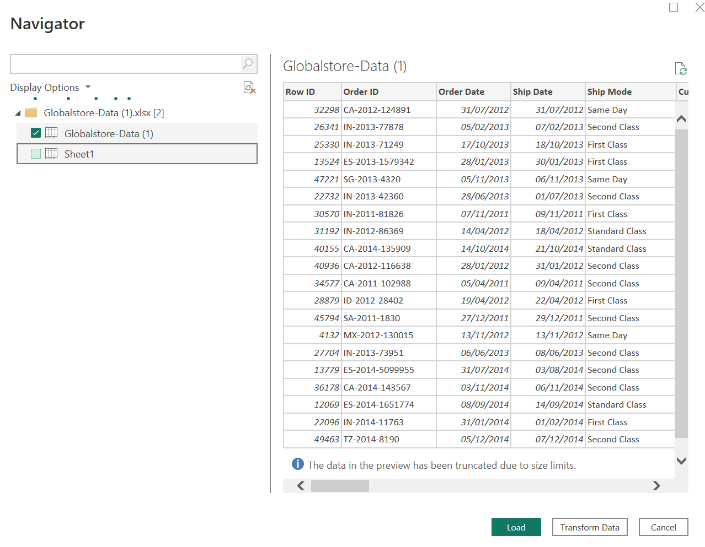
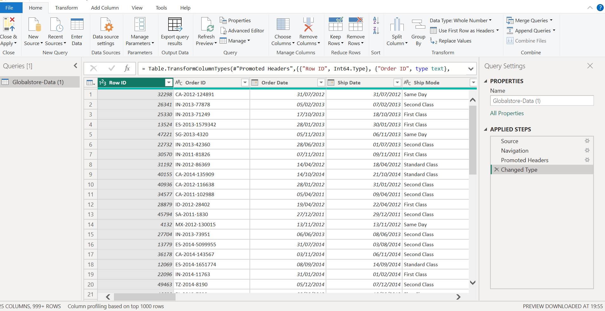
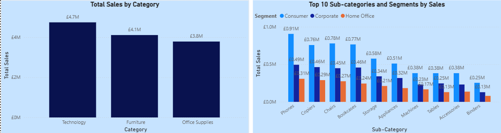
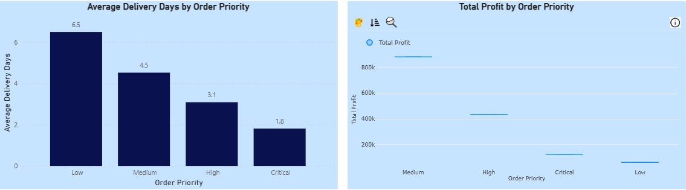
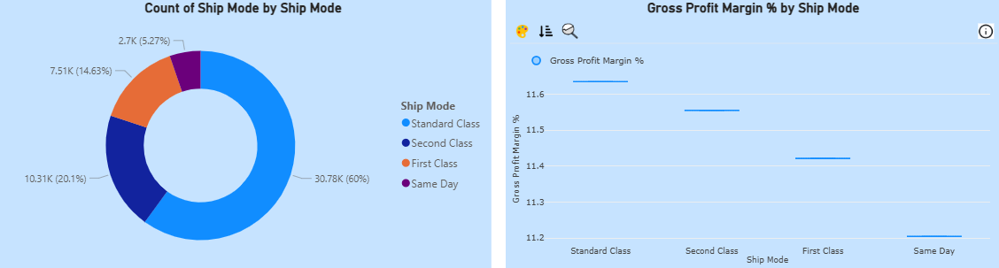
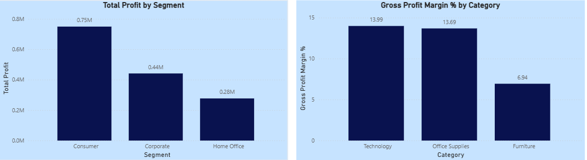
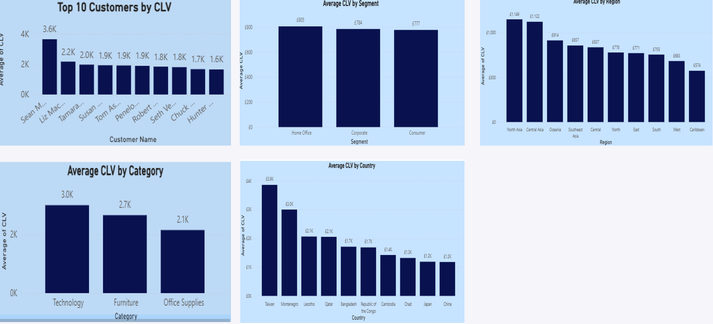

# Data Portfolio: Excel to Power BI

## Business Problem 
The client was working with raw customer data stored in Excel but lacked a structured way to analyze customer behavior and identify meaningful customer segments. Without clear segmentation, marketing efforts were broadly targeted, resulting in inefficient campaign spending, lower engagement rates, and missed revenue opportunities. The business needed a centralized, visual, and interactive solution to better understand customer groups, purchasing patterns, and key behavioral trends to support data-driven marketing and strategic decision-making.

## Business Impact:
This project delivered an interactive Power BI dashboard that transformed raw customer data into clear, actionable customer segments. By enabling the business to visualize customer behavior and segment performance, the solution empowers marketing teams to:

- Design targeted marketing campaigns based on distinct customer profiles
- Improve customer engagement and retention through personalized strategies
- Identify high-value and high-risk customer segments
- Optimize marketing spend and increase campaign effectiveness
- Support leadership with real-time, data-driven insights for strategic decisions

As a result, the business is now equipped with a scalable analytics solution that replaces manual Excel reporting with a modern, automated, and insight-driven approach.

## Data Analysis Steps/WorkFlow

### Data Extraction
Data was extracted from Excel into Power Query for Data Cleansing

### Data Cleansing/Transformation
- Number of Columns = 24
- Number of Rows = 51290
- Duplicates = 0
- Blank Rows/Columns = 0
- Changed Data Type
 

### Data Loading
Loaded data into Power BI for Analysis

## Key Questions
- What is the total sales volume for each customer segment (Consumer, Corporate, Home Office)?
- Which countries or regions generate the highest revenue?
- Which product categories contribute the most to overall sales?
- How do order priorities (Critical, High, Medium, Low) impact delivery times?
- Which shipping modes (Same Day, First Class, Second Class, Standard Class) are most commonly used?
- What are the most profitable customer segments, countries, and cities?
- How do discounts offered impact overall sales and profitability?
- What are the monthly or quarterly sales trends over the years?
- Which customers contribute the most to the business over time?
- How do customer segments perform differently across various global regions?

### Summary of Key Insights- Dashboard

### Question 1: What is the total sales volume for each customer segment (Consumer, Corporate, Home Office)?

The sales distribution shows a clear dominance of the Consumer segment.
Consumer: £6.5M is the largest contributor, accounting for most of the total revenue,
Corporate: £3.8M is a strong but secondary segment,
Home Office: £2.3M is the smallest revenue generator.

### Question 2: Which countries or regions generate the highest revenue?

The top city is New York with £256K in sales, across all segments, while the top region is the Central region accounting for 22% of total sales- £11.0M

### QUESTION 3: Which product categories contribute the most to overall sales?

Technology is the largest contributor to across all segments, and accounts for 37% of total sales - £4.7M. Phones are the highest contributor to sales across all segments, accounting for 13% of total sales - £1.71M

### QUESTION 4: How do order priorities (Critical, High, Medium, Low) impact delivery times?

Delivery speed aligns strongly with order priority. Critical orders are fulfilled in under 2 days on average, while low-priority orders take over 6 days.

Medium-priority orders generate most of the total profit, contributing more than all other priority levels combined. High-priority and Critical orders also contribute positively, while Low-priority orders generate minimal profit.

### QUESTION 5: Which shipping modes (Same Day, First Class, Second Class, Standard Class) are most commonly used?

Standard shipping accounts for 60% of all orders, making it the most widely used ship mode. Every Category relies heavily on standard shipping: Office Supplies, Technology, and Furniture all show their highest shipment volumes under Standard Class. 

Gross profit is consistent across shipping methods, Standard 11.6%, Second 11.58%, First 11.4%, Same Day 11.2%, showing that faster shipping has minimal impact on profitability. Standard shipping not only leads in volume but also drives most of the net profit at £263K.

### QUESTION 6: What are the most profitable customer segments, countries, and cities?

The most profitable segment is the Consumer segment contributing £750K to Total Profit. 

Technology contributes the most to profit across all segments.

### QUESTION 7: How do discounts offered impact overall sales and profitability?

For Category: Higher average discounts are linked with lower total profit. This is evident as Furniture has the highest discount (0.17) and the lowest profit (£0.28M), while Technology has the lowest discount (0.13) and the highest profit (£0.66M).

For Segment: Higher average discounts correlate with higher profit. This is shown by Consumer Segment having the highest discount (0.142) and highest profit (£0.75M), while Home Office has the lowest profit (£0.28M) and lowest discount.

### QUESTION 8: What are the monthly or quarterly sales trends over the years?

Sales increased steadily from £2.3M in 2011 to £4.3M in 2014, showing a near-doubling of revenue within just four years.

Across all four years, Q4 repeatedly delivers the highest sales, with values rising from £0.84M in 2011 to £1.54M in 2014.

### QUESTION 9: Which customers contribute the most to the business over time?

There is a clear top performer, with the highest customer CLV at £3.6K, significantly above the rest, and worth 65% more than the second-highest customer.

Home Office has the highest CLV £805, followed by Corporate £784 and Consumer £777.

North Asia and Central Asia stand out with CLV above £1,100, substantially higher than all other regions.

### QUESTION 10: How do customer segments perform differently across various global regions?

Central is by far the highest-performing region across all segments.

The Consumer segment consistently delivers the highest sales in every region.

Corporate is the middle performer across most regions.

Home Office contributes the lowest revenue in every region.

South and North Regions Are Strong Secondary Markets.

## Recommendations:

Based on insights derived from our analysis, the following are the recommendations:

- Strengthen Focus on High-Value Segments and Products: Consumer drives the highest sales at £6.5M and highest profit £0.75M. Expand targeted campaigns for Consumer buyers and develop loyalty programs that reward repeat technology purchases.
  
- Increase Strategic Focus on Technology and phones: Technology is the largest revenue category £4.7M, and Phones are the top subcategory £1.71M. Increase product range, bundles, and cross-sell opportunities, and launch premium upsell programs (e.g., warranties, accessories).

- Improve Profitability Through Smarter Discount & Priority Management: Reduce discounts in Low-Profit Categories such as Furniture. Optimize Order Priority Profit Structure by encouraging customers toward medium-priority orders through small incentives. Profitability can be maintained by reviewing costs associated with Critical/High priority orders.

- Invest More in High-Performing Regions: Central with £2.82M sales (critical growth market), North Asia & Central Asia show industry-leading CLV >£1,100. Increase marketing spend and sales capacity here. For low performing regions (Caribbean, Canada, East, West), review fulfilment costs, competition levels, and pricing, and consider targeted micro-campaigns before committing large budgets.
  
- Improve Shipping Profitability: Standard shipping represents 60% of all orders and delivers highest profit £263K. Encourage customers to choose Standard by highlighting savings and defaulting Standard as the pre-selected option in checkout.

- Leverage Q4 as a Peak Sales Period: Q4 is consistently the highest performing season. Front-load Q4 with major campaigns to increase sales. Expand inventory before Q4 to avoid shortages Also use YoY growth trends for forecasting as sales nearly doubled from £2.3M (2011) to £4.3M (2014).
  
- Adopt City-Level Strategy: New York leads all cities £256K, far above the rest. Focus sales efforts on top metropolitan areas. Build city-specific campaigns (local events, citywide promotions).
  

## Next Steps

Future improvements to this project could include automating the data pipeline through direct database connections and scheduled refreshes in Power BI Service. Additional DAX measures can be developed to support advanced KPIs such as year-over-year growth and forecasting. The dashboard can also be enhanced with drill-through functionality, row-level security for role-based access, and mobile-optimized reporting. Finally, the solution could be deployed to Power BI Service for stakeholder sharing and real-time insights.

## 📂 Power BI File Access

Due to Power BI tenant restrictions, a public live link is not available.  
The full interactive `.pbix` file and dataset are provided in this repository for download and exploration.

## 🚀 How to Use

- Download the Global Data Analysis.pbix file from this repository.
- Ensure Power BI Desktop is installed on your machine.
- Open the .pbix file in Power BI Desktop.
- If prompted:
  - Click Refresh to load the data
- Use:
  - Filters
  - Slicers
  - Drill-through pages to interact with the dashboard and explore customer segments in detail.

